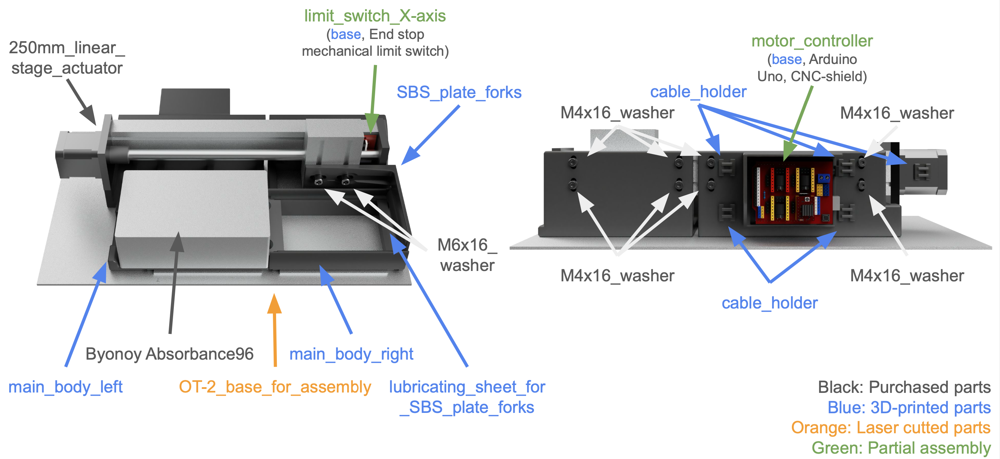

# PlateShuttle

- 🏗 **Paper (Now Building...)**

PlateShuttle is an open-source hardware/software solution for automated plate handling in Opentrons-2 systems. This DIY lab device enables seamless loading/unloading of plates, enhancing workflow efficiency while maintaining integration with Opentrons infrastructure.



## Overview
PlateShuttle offers a cost-effective solution for labs looking to automate plate handling processes. By leveraging open-source design and software, labs can build, modify, and improve upon this system to meet their specific needs.

## Features
- Easy making parts and installation, setup, use
- Open-source hardware and software design
- Seamless integration with Opentrons-2 platforms
- Customizable plate handling mechanisms
- Extensible architecture for future improvements

## Contents
This repository contains all necessary files to build and operate your own PlateShuttle:

- CAD files for 3D printing and manufacturing
- Software for controlling the device
- Documentation for assembly and operation
- Examples of implementation in various laboratory workflows

## Getting Started

### Prerequisites
All are written in [assembly_v1.pdf](./docs/assembly/assembly_v1.pdf)
- [Opentrons-2 platform (opentrons)](https://opentrons.com/products/ot-2-robot) 
- [Absorbane 96 (byonoy)](https://byonoy.com/absorbance-96/)
- 3D printer (or access to 3D printing services)
- Laser Cutter (or access to laser cutting services)
- Some open-source electrical boards/parts`a
- Control computer (Mac, Windows, Linux)
- Python 3.6 or higher

### Assembly/Installation
See [assembly_v1.pdf](./docs/assembly/assembly_v1.pdf) for detailed instructions.

## Documentation
Full documentation is available in the docs directory.

## License
This project is licensed under the MIT License - see the LICENSE file for details.

## Folder Structure
```
PlateShuttle/
├── CAD/                    # CAD files for hardware components
│   ├── STEP/               # STEP format files for CAD software
│   ├── 3DPrinter/          # STL files for 3D printing
│   └── LaserCutter/        # svg and step files for laser cutting
├── docs/                   # Documentation
│   ├── assembly/           # Assembly instructions
│   ├── operation/          # Operation guides
│   └── INSTALLATION.md     # Installation guide
├── examples/               # Example implementations
│   ├── protocols/          # Example Opentrons protocols
│   └── workflows/          # Example laboratory workflows
├── LICENSE                 # License information
└── README.md               # This file
```

# Acknowledgments
- Opentrons community for inspiration and support